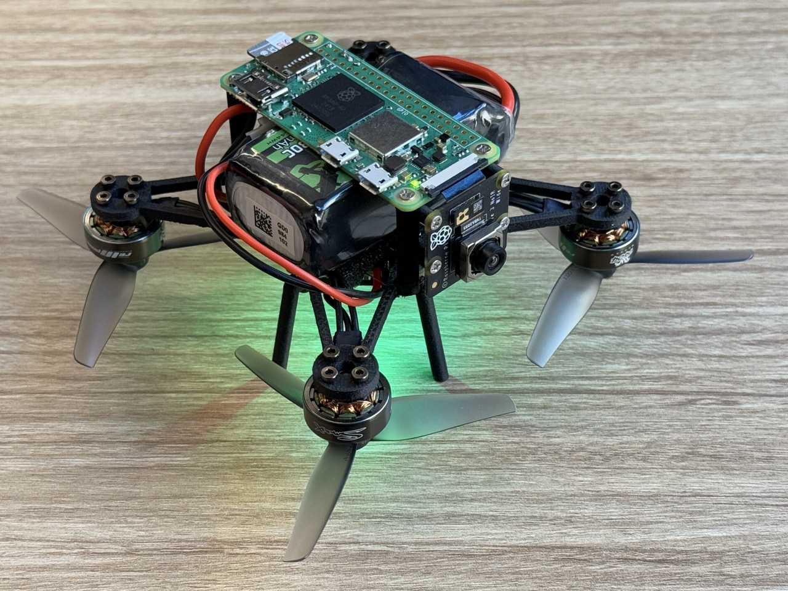
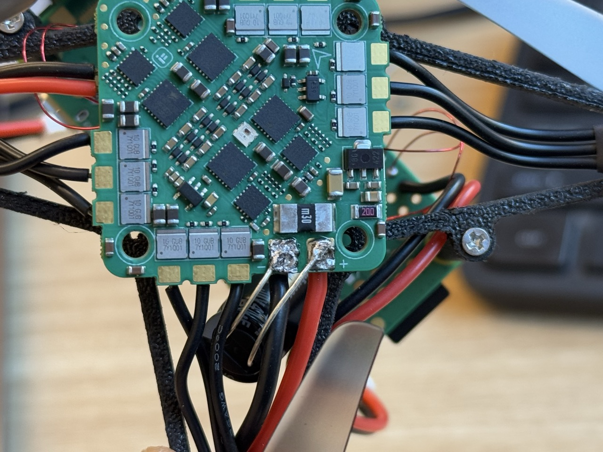
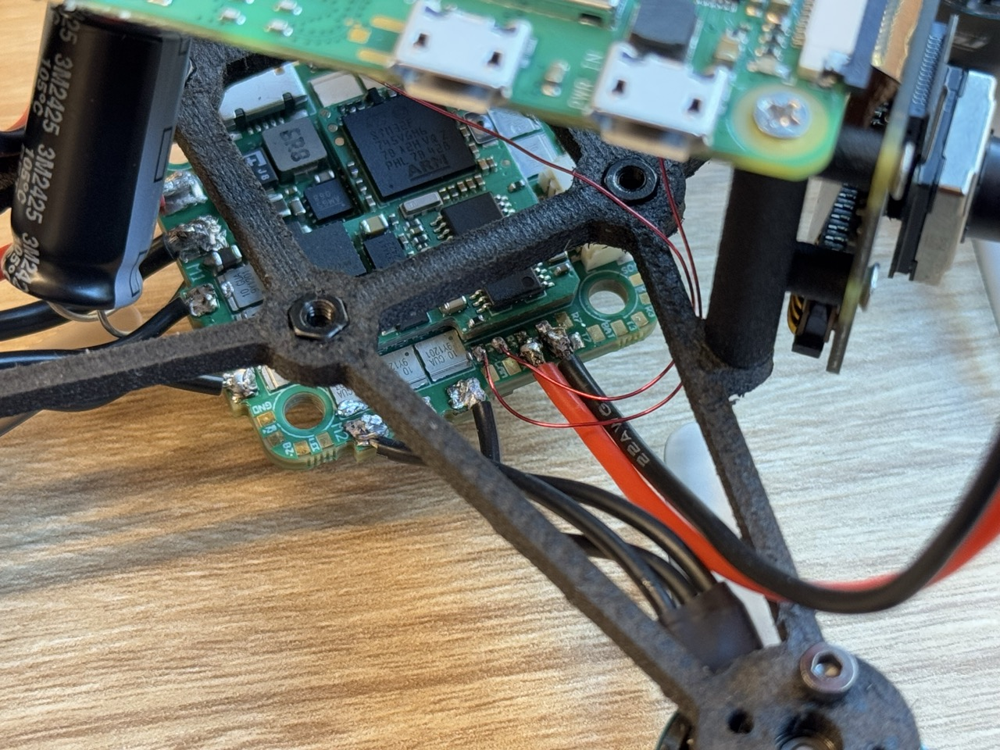
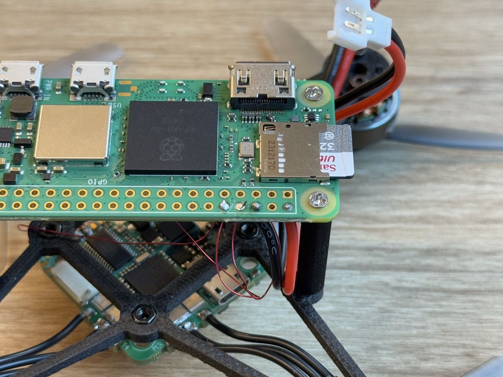
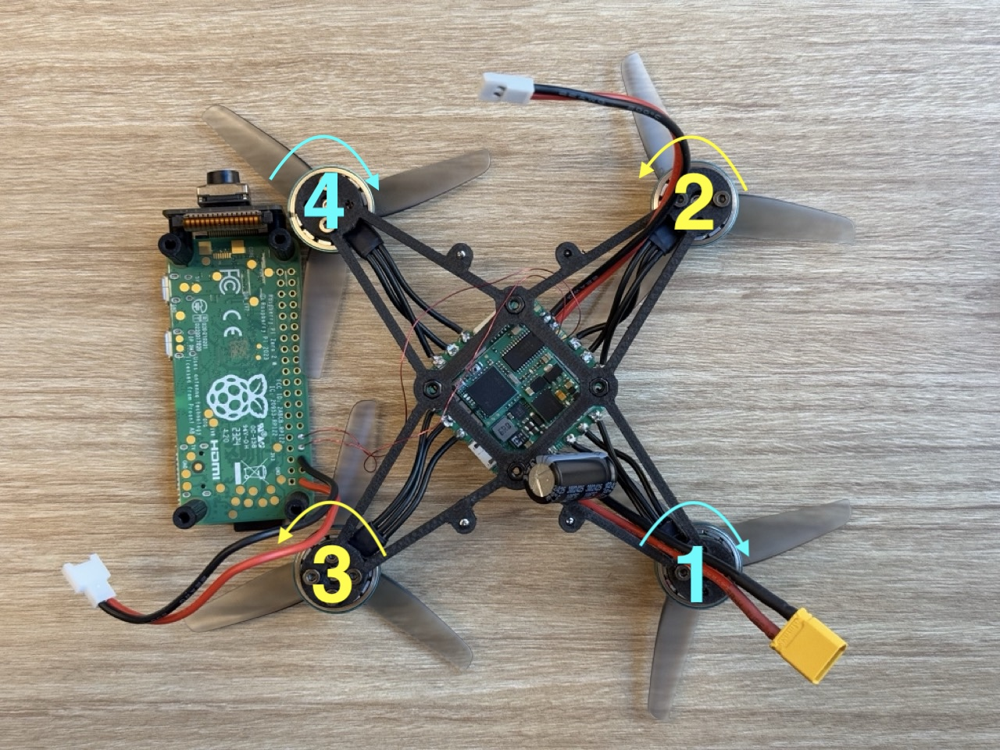

# FLS
A prototype for flying light specks



For BetaFlight or iNav see [here](betaflight_inav).

## Steps to reproduce
1. Flash the firmware to the flight controller
2. Connect the motors and other connections
3. Test the direction of rotation for each motor
4. Assemble the parts on the frame
5. Configure the flight controller
6. Configure Raspberry Pi


## List of parts
1. [iFlight BLITZ Whoop F7 AIO flight controller](https://shop.iflight.com/BLITZ-Whoop-F7-AIO-Pro1927)
2. [1404 Plus 6000kv motors](https://www.myfpvstore.com/motors/rcinpower-smoox-1404-plus-whoop-motor-gunmetal-blue-6000kv/?srsltid=AfmBOoqFCYuKe_lZ4RztSoZIATdFEbraSl6UrF0mSqzx-S929OD5cDPk4uk)
3. [HQ Prop T3X2X3 Tri-Blade 3" Prop 4 Pack 1.5mm Shaft](https://www.racedayquads.com/products/hq-prop-t3x2x3-1-5mm-shaft-tri-blade-3-prop-4-pack-choose-color?currency=USD&variant=40070619332721&stkn=ed68f1cb6bdd&tw_source=google&tw_adid=717685084952&tw_campaign=21821665874&gad_source=1&gclid=Cj0KCQiA0fu5BhDQARIsAMXUBOJjdMI9eP1X8UswLH8dP3WppF2tAKTShEN8dZYi1DE7O35mmgM2xEEaAqgSEALw_wcB)
4. [Raspberry Pi Zero 2 W + SD card with Raspberry OS](https://www.pishop.us/product/raspberry-pi-zero-2-w/?src=raspberrypi)
5. [Raspberry Pi Camera Module 3 Wide NoIR](https://www.pishop.us/product/raspberry-pi-camera-module-3-wide-noir/)
6. [Lipo Battery 850mAh 80C 11.1V 3S](https://a.co/d/hYqlLo6)
7. [4pcs XT30 XT-30 to XT60 XT-60 Male Female RC Connector Adapter](https://a.co/d/1hygTM4)
8. [M2 screws](https://a.co/d/6PfypLR)
9. [Enameled copper wire](https://a.co/d/gU8BKby)
10. [Charger](https://a.co/d/1dvDkIm)
11. [Molex connectors](https://a.co/d/1OW0Edu)


## Install ArduPilot on the flight controller
This prototype uses iFlight BLITZ Whoop F7 AIO which is a all-in-one flight controller with built-in ESC.
The default firmware on the BLITZ Whoop F7 AIO is BetaFlight. Here is how to replace it with ArduPilot.

Custom build ArduPilot with optical flow support:
with ek3 optical flow fusion: https://custom.ardupilot.org/builds/copter:BlitzF745AIO:450ffd1520a64c00f0bd4492a479e43c75e170d7:e71419b2971fff2e338a09a9cc65b3b2/
https://custom.ardupilot.org/builds/copter:BlitzF745AIO:bfa40f76d8808a8c51c63293a869967a488f229b:e2ae6074c5bcf21c45d9cb0401fd5167/
```
default firmware (December 2024):
# version
# Betaflight / STM32F745 (S745) 4.5.1 Jul 27 2024 / 07:57:01 (77d01ba3b) MSP API: 1.46
# config rev: 11c7dec
# board: manufacturer_id: IFRC, board_name: IFLIGHT_BLITZ_F7_AIO
```

1. Install [STM32CubeProgrammer](https://www.st.com/en/development-tools/stm32cubeprog.html).
2. Install a compatible ground station software from [here](https://ardupilot.org/plane/docs/common-install-gcs.html) (QGroundControl for mac).
3. Open [this link](https://firmware.ardupilot.org/), go to Copter > stable > BlitzF745AIO and download `arducopter_with_bl.hex`.
4. Follow instructions (here)[https://ardupilot.org/plane/docs/common-loading-firmware-onto-chibios-only-boards.html#upload-the-firmware-to-autopilot] to install the firmware using STM32 Cube Programmer.


## Connections
1. Measure and cut the motor's wires (I kept around 32 mm).
2. Solder the wires to the motor pins on the flight controller board. For now the order of the wires doesn't matter we'll test the rotation direction in the next step and reorder them if necessary. You can use the pins on either side of the board. I used the upper part (where the USB port is present)
3. Solder the XT30 wire to the power pins (red to the + and black to -). I used the upper side pins.
4. Solder the capacitor the power pins, pay attention to the - and + pins. I connected the capacitor to the bottom side.
   
5. Connect a wire with male Molex connector to the 5V and GND pins of the flight controller (red to 5V and black to the GND).
6. Connect a wire with female Molex connector corresponding pins of Raspberry Pi.
7. See [this guide](https://www.raspberrypi.com/documentation/computers/raspberry-pi.html#gpio) for Raspberry Pi pins and [this](https://ardupilot.org/plane/docs/common-iflight-blitzf7AIO.html#pinout) for the flight controller pins.
8. Cut two pieces of 10-cm enameled copper wire and solder them to the T4 and R4 pins on the flight controller board. This is for the communication of the flight controller and Raspberry Pi. SERIAL4 and SERIAL7 pins are free for custom applications. See [here](https://ardupilot.org/plane/docs/common-iflight-blitzf7AIO.html#pinout).
I used SERIAL4 (T4 and R4 ports).
   Note: Make sure the coating of the enameled wire melts as you solder them for proper connection.
9. Connect the TX pin of the Raspberry Pi to the RX pin of the flight controller.
10. Connect the RX pin of the Raspberry Pi to the TX pin of the flight controller.




## Test Motors
Note: remove the propellers before testing the motors.

1. Connect to the flight controller using the QGC. And go to the Vehicle Configuration by clicking on the `Q` icon on the top left corner.
2. Go to the Motors tab.
3. Place the motors in the correct direction in front of you. M2 and M4 are the front motors. The white arrow printed on the flight controller board shows the front direction, in our setup it should be facing the table. Note that the motors are facing down in this setup.
    
4. Connect a battery to the flight controller.
5. Enable the slider and motor output then spin each motor slowly and feel the direction of rotation with your fingers.
6. If the motor is rotating in the wrong direction note its number.
7. Grab your solder and swap any two wires of the motor with wrong direction to reverse its rotation direction.
8. Finally, test one more time to make sure each motor rotates in the direction shown in the picture (M1 and M4 cw, M2 and M3 ccw).


## Configure the flight controller
After flashing the firmware and assembling the drone successfully, connect to the flight controller using USB and open QGC.
Set Alignment to None because in our design the flight controller arrow is facing forward.


### Frame
Choose Quad and `X` as the frame type.

### Sensor Calibration
Go to the `Sensors` tab and follow the calibration steps for Accelerometer, Level Horizon, and Gyro.


### UART Connection
1. Go to the `Parameters` tab.
2. Set `FRAME_TYPE` to BetaFlightX.
3. Set `ARMING_CHECK` to 0.
4. Set `SERIAL4_PROTOCOL` to MAVLink2 for Raspberry Pi serial connection.
5. Set `SERIAL4_BAUD` to 115200.
6. Set `SERIAL3_PROTOCOL` to MAVLink1 for the optical flow sensor.
7. Set `SERIAL3_BAUD` to 115200.
8. Set `SERIAL3_OPTIONS` to `Don’t forward mavlink to/from`.
9. Set `FLOW_TYPE` to Mavlink.
10. Set `RNGFND1_TYPE` to Mavlink.
11. Set `RNGFND1_MAX` to 200 to set range finder’s maximum range to 2m. 
12. Set `RNGFND1_MIN` to 1.
13. Set `RNGFND1_ORIENT` to 25 (Downward).
14. Click `Reboot Vehicle` from the `Tools` menu.


## Configure Raspberry Pi

### Install ubuntu
1. Download ubuntu server for Raspberry Pi from [here](https://ubuntu.com/download/raspberry-pi). I used 24.04.1 server arm64 raspi.
2. Use Raspberry Pi Imager to install the downloaded image on an SD card.
3. During the installation set up WLan, username and password, and enable ssh for easier access.
4. Insert the card into the Raspberry Pi and boot.


### Install ROS 2
1. Follow instructions [here](https://docs.ros.org/en/jazzy/Installation.html) to install ROS 2 Jazzy.
2. Add ros to bashrc: 
   ```
   echo "source /opt/ros/jazzy/setup.bash" >> ~/.bashrc
   source ~/.bashrc
   ```

### Install Mavros
See [here](https://github.com/mavlink/mavros/blob/ros2/mavros/README.md#binary-installation-deb) for instructions.
Note that you need to use the appropriate ros distribution foxy, jazzy, etc.

```
sudo apt install ros-jazzy-mavros ros-jazzy-mavros-extras
sudo apt install geographiclib-tools
sudo geographiclib-get-geoids egm96-5
sudo geographiclib-get-gravity egm96
sudo geographiclib-get-magnetic igrf
```

### UART Connection
1. add the following lines to the `/boot/firmware/config.txt`:
  ```
  enable_uart=1
  dtoverlay=disable-bt,uart0,ctsrts
  ```
1. Ensure there is no line like `console=serial0,115200` in `/boot/firmware/cmdline.txt`. If present, remove it to prevent the Raspberry Pi from using UART for console output.
2. Reboot Raspberry Pi: `sudo reboot`.
3. Power up the drone via a battery. And connect the Raspberry Pi's power cable to the flight controller board.


### Run Mavros
1. SSH to the Raspberry Pi.
2. Start `tmux`.
3. Split the window using `control+b` then `%`.
4. In one window run `ros2 launch mavros apm.launch fcu_url:=serial:///dev/ttyAMA0:115200 gcs_url:=udp://@192.168.8.130:14550`
5. In the other run `ros2 topic echo /mavros/state`


### Install Mavlink-Router
Install [mavlink-router](https://github.com/mavlink-router/mavlink-router?tab=readme-ov-file).
```mavlink-routerd -e 192.168.8.130:14550 /dev/ttyAMA0:115200```


### MavProxy
https://ardupilot.org/mavproxy/docs/getting_started/starting.html
```mavproxy.py --master=/dev/ttyAMA0 --baudrate=115200```

### Troubleshoot
- Ensure TX and RX pins are properly connected (use GPIO 14 for TX and GPIO 15 for RX).
- Use a multimeter or a simple circuit like an LED and a battery to test the connections of UART pins.
- Ensure `ls -l /dev/serial*` or `ls -l /dev/ttyAMA0` shows an entry.
- Ensure the baud rate is set correctly (115200 is typical).


### Useful Resources
https://ardupilot.github.io/MethodicConfigurator/
https://www.ecalc.ch/index.htm
