# 60mm FLS with MicoAir H743v2 AIO

## V5.3.60

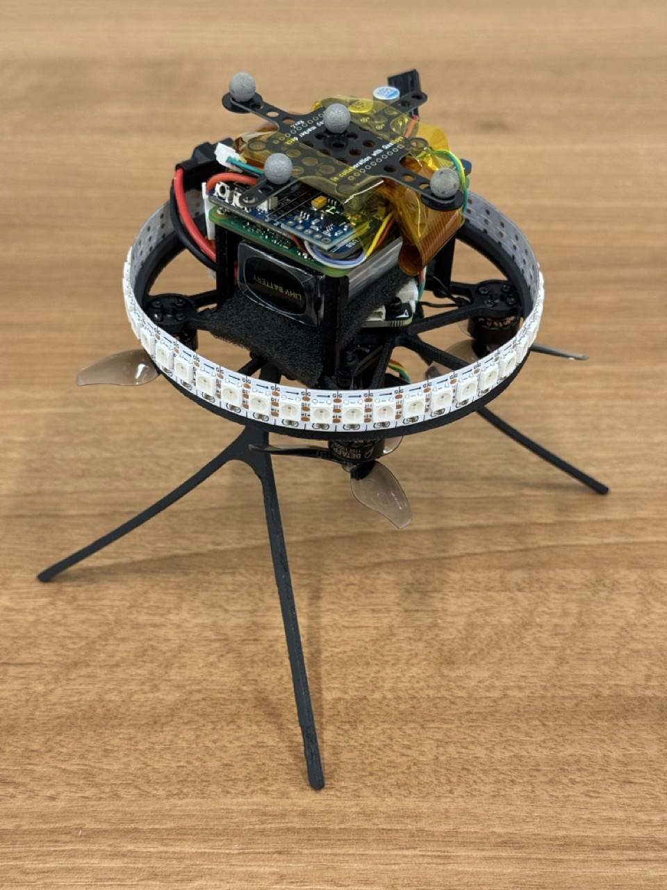
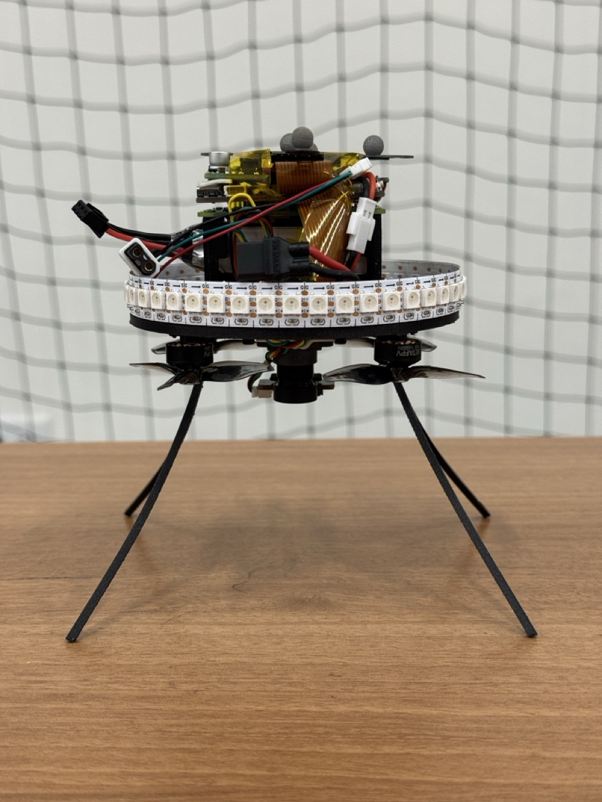
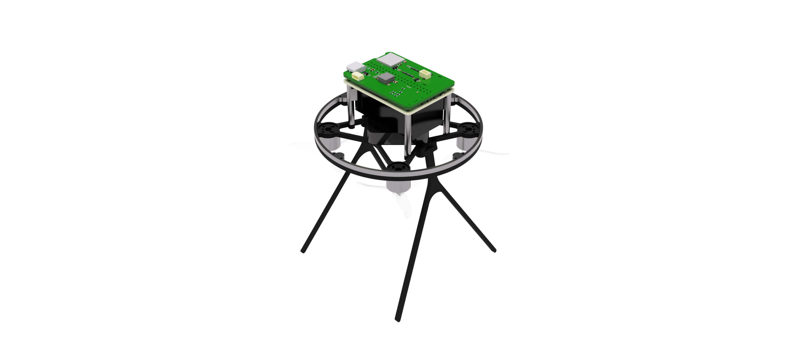

3D model: `v5/3d/FLS_v5.3.60.f3z`.

## Parts

- [MicoAir H743v2 AIO 45A](https://store.micoair.com/product/micoair743v2-aio-45a/)
- [6000KV Motors](https://flywoo.net/products/robo-1303-6000kv-2-4s-fpv-motor?srsltid=AfmBOooB2tLsMgUGBJvwiC2U68SPmQVYsO690a0YA3RrtI_vRBE50otv)
- [Raspberry Pi CM5](https://www.raspberrypi.com/products/compute-module-5/?variant=cm5-104032)
- [Raspberry Pi Camera Module 3 Wide NoIR](https://www.pishop.us/product/raspberry-pi-camera-module-3-wide-noir/)
- [Nano Base Board (A) for Raspberry Pi Compute Module 5](https://www.waveshare.com/cm5-nano-a.htm), also
  on [Amazon](https://a.co/d/2dPvVRj)
- [Pololu 5V, 5A Step-Down Voltage Regulator D24V50F5 to power Raspberry Pi](https://www.pololu.com/product/2851)
- [Molex connectors](https://a.co/d/1OW0Edu)
- [2S 650mAh 120C Lipo Battery](https://a.co/d/c1O34hy)
- [Raspberry Pi Camera Module 3 Wide NoIR](https://www.raspberrypi.com/products/camera-module-3/?variant=camera-module-3-noir-wide)
- [Raspberry Pi Camera Module 3 Sensor Cable Extension](https://www.arducam.com/200mm-sensor-extension-cable-for-raspberry-pi-v2-v3-support-working-on-raspberry-pi-and-jetson.html)
- [MicoAir MTF-02 Flow and Range Sensor](https://robofusion.net/products/micoair-optical-flow-lidar-sensor-mtf-02-compatible-with-ardupilot-px4-inav?variant=47335540359487)
- 2-inch Propellers (Any of the bellow options):
    - [Gemfan D51 Ducted 4-Blade](https://www.getfpv.com/gemfan-d51-ducted-durable-4-blade-51mm-cinewhoop-propeller-set-of-8.html?vid=13662&utm_source=google&utm_medium=cpc&utm_campaign=DM+-+NB+-+PMax+-+Shop+-+No-index+-+SM+-+ALL+%7C+Full+Funnel&utm_content=pmax_x&utm_keyword=&utm_matchtype=&campaign_id=20799936859&network=x&device=c&gc_id=20799936859&gad_source=1&gclid=Cj0KCQjwzYLABhD4ARIsALySuCQUIDG2VWcM8jVkIEcAe1tfF0vmCpzYmgZQzs1EyRDmPbsOM4Vi9hsaAoAYEALw_wcB)
    - [Gemfan Hurricane 2023S 3-Blade](https://www.getfpv.com/propellers/micro-quad-propellers/gemfan-hurricane-2023s-3-blade-propeller-set-of-8.html)
    - [HQProp T2X2X3 3-Blade](https://www.getfpv.com/propellers/micro-quad-propellers/hqprop-t2x2x3-3-blade-propeller-set-of-4.html)

You can also use CM4 instead of CM5 (CM4 is slower than CM5):

- [Raspberry Pi CM4](https://www.raspberrypi.com/products/compute-module-4/?variant=raspberry-pi-cm4104032)
- [Nano Base Board (A) for Raspberry Pi Compute Module 4](https://www.waveshare.com/cm4-nano-a.htm), also
  on [Amazon](https://a.co/d/gfsPdik)

## Assembly

### 3D Print

We used Bambu X1 Carbon printer to print the following parts using Bambu PA6-CF filament. The models are available
in the `3d` directory. All the items you need to print is inside the Bambu project named `print_plates.3mf` open 
this file using Bambu studio and print the plates.

| name                | qty |
|---------------------|-----|
| frame_v4            | 1   |
| pi_holder_v2_a      | 2   |
| pi_holder_v2_b      | 1   |
| pi_holder_v2_b_slit | 1   |
| landing_gear_v3     | 2   |
| cam_holder_l        | 1   |
| cam_holder_r        | 1   |
| sensor_holder       | 1   |

Important Notes:

- Dry the filament before printing for the best result.
- Use smooth PEI / high temp plate.
- Clean the oil, fingerprints, and printing waste from the plate before printing.
- For printing Plate 1 use `0.2mm strength` profile, add 5mm of outer brim, and use `concentric` top and bottom
  surface pattern.
- For Plates 2 and 3 use `0.16mm high quality` profile. Enable 5mm outer brim for Plate 2. Enable manual 
  support for Plate 3.
- After printing completes do not remove the part. Wait util the plate temperature drops to around 40 degrees
  Celsius. Otherwise, the printed part may bend permanently.
- Store the filament in a sealed zip bag after use.


### Installation

1. Install the motors to the frame using the black M2 screws that are included in their package. You can install
   them on either side of the frame.
2. Install the rubber grommets on the FC in a way that the taller part is on the side that the USB port is.
3. Solder the battery cable, Molex cable and the capacitor to the FC battery pads.
4. Install the FC on the frame. Note the orientation of the FC. The white arrow on the top of the FC shows the front
   direction.

5. Solder the wires of the motors to the motor pads of the FC, the order of the wires does not matter.
6. Install Pi holders on the frame.
   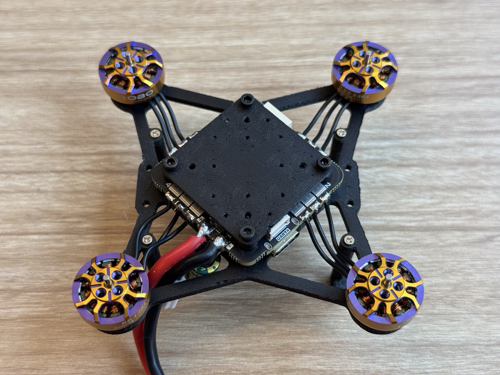
   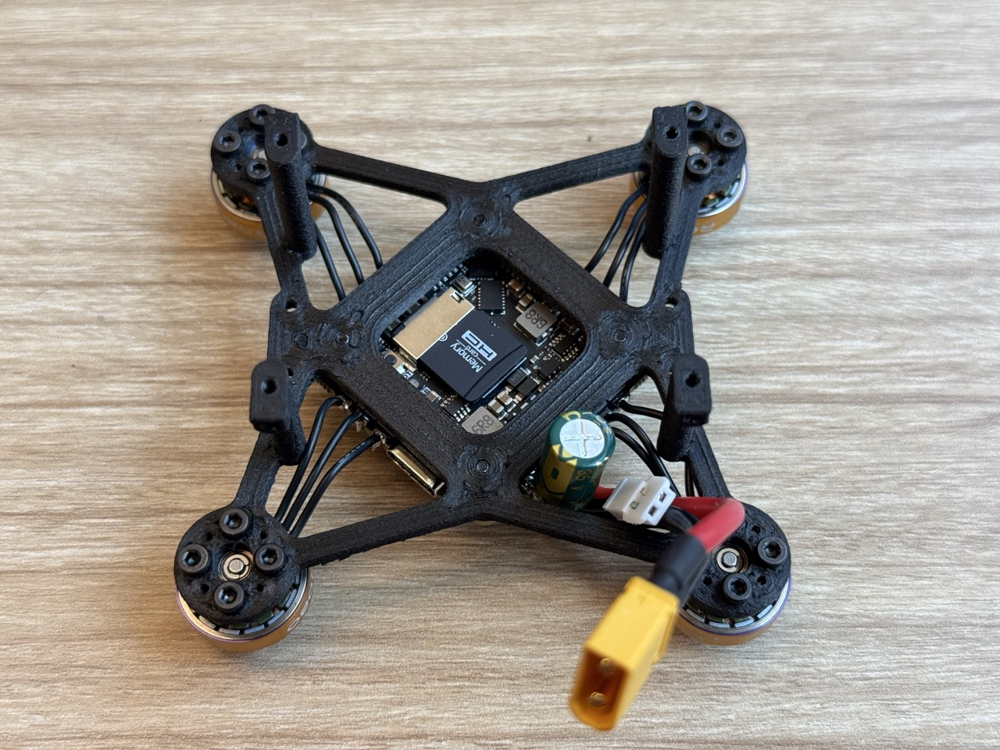
   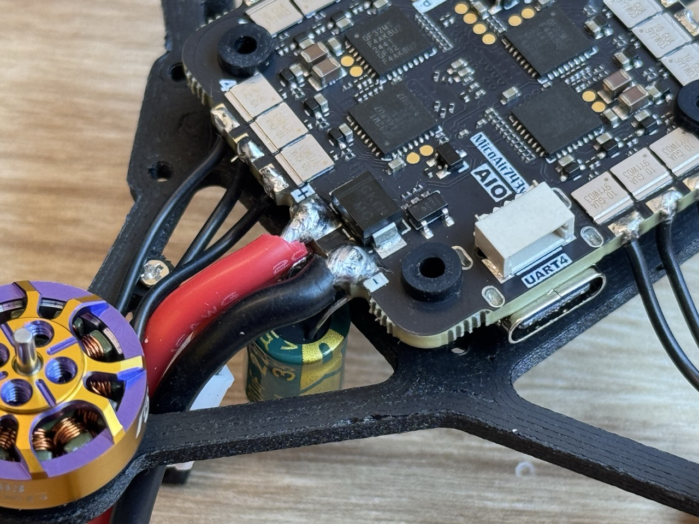


7. Install Pi CM5 on the frame, note the orientation.
   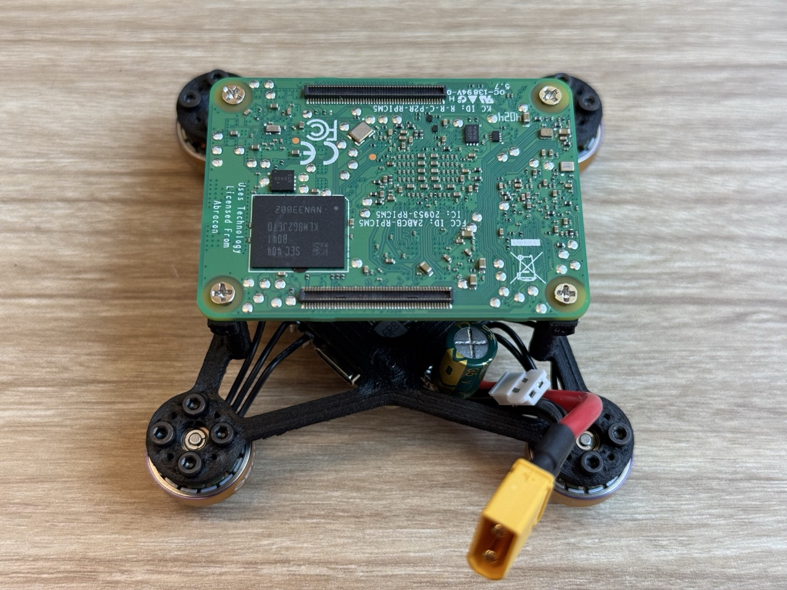

8. Solder a Molex cable, power adapter, and TX/RX cables on the NANO baseboard.
   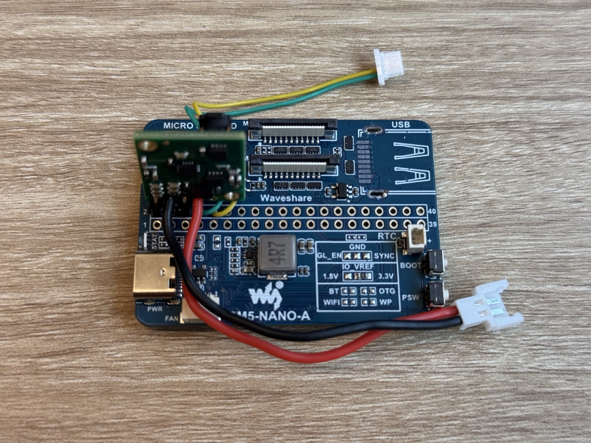
   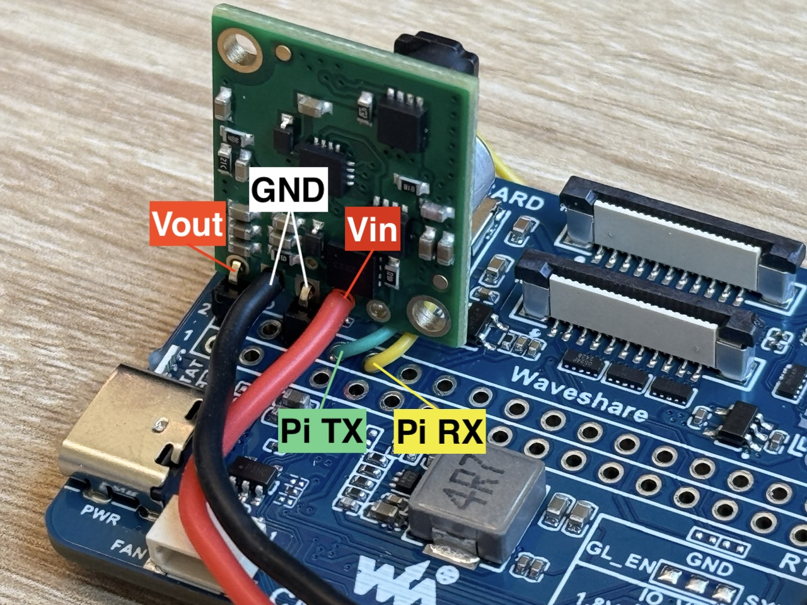
   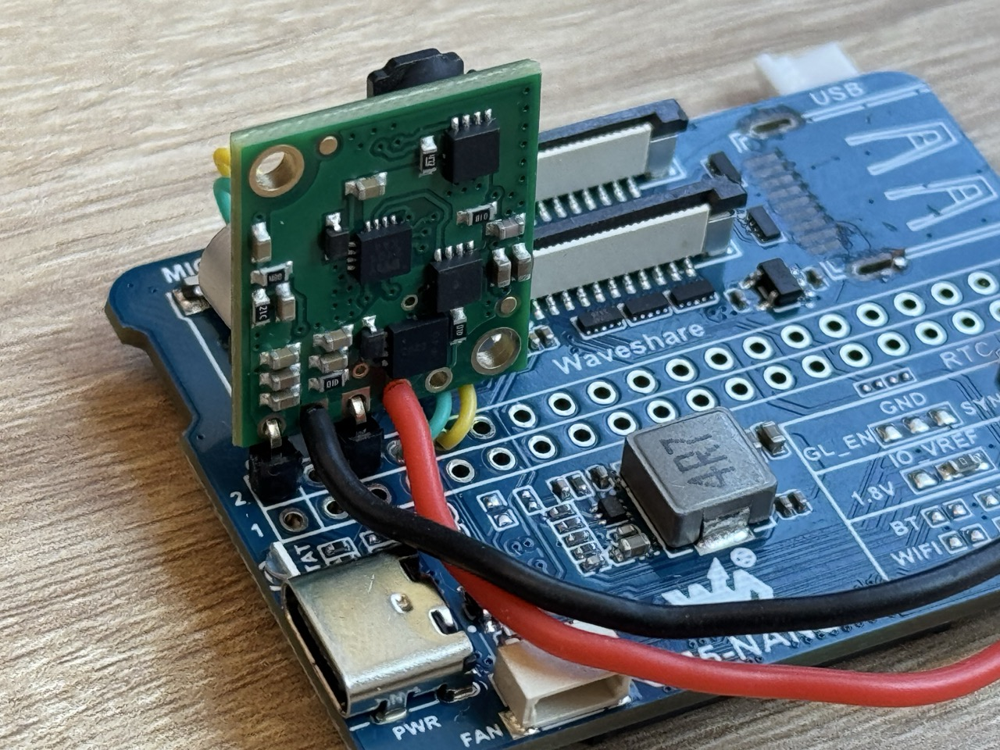

We used the 4-pin connector that comes with the FC as the TX/RX cable. We removed the black and green wires as we
are not using them. This connector connects the FC TX to Pi RX (yellow) and FC RX to Pi TX (green).

9. Install the NANO board on the Pi CM5.
   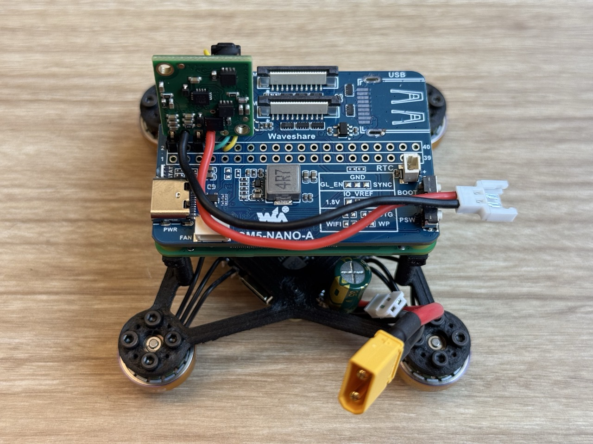
10. Connect the TX/RX and power connector to the FC.
    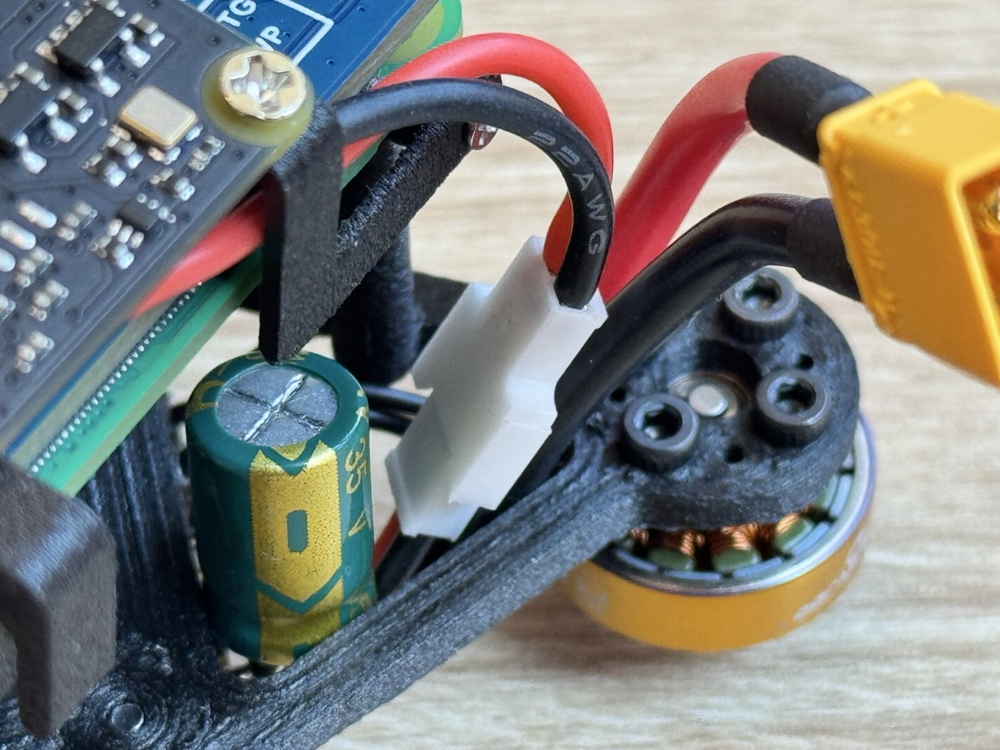
    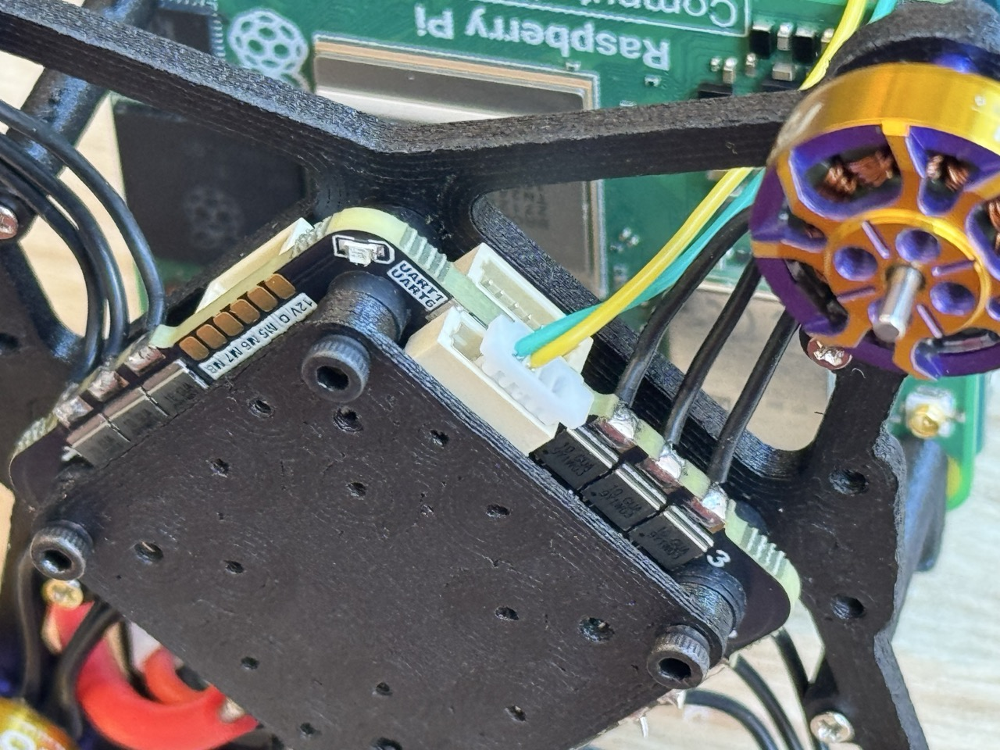

11. Remove the camera sensor from the Raspberry Pi Camera board and install the camera holders to it using 4 M2x3
    screws.
    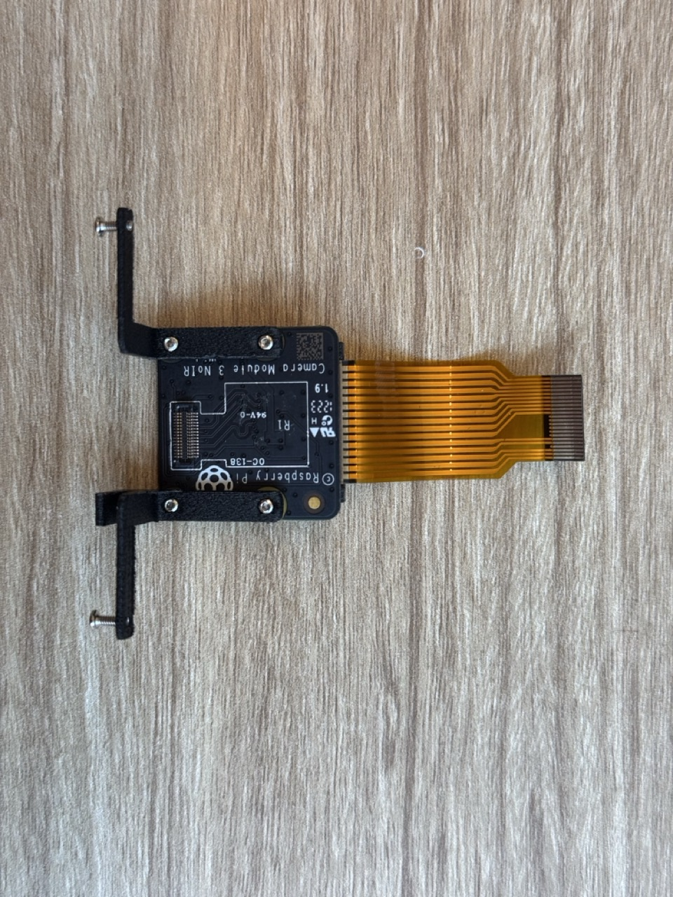
    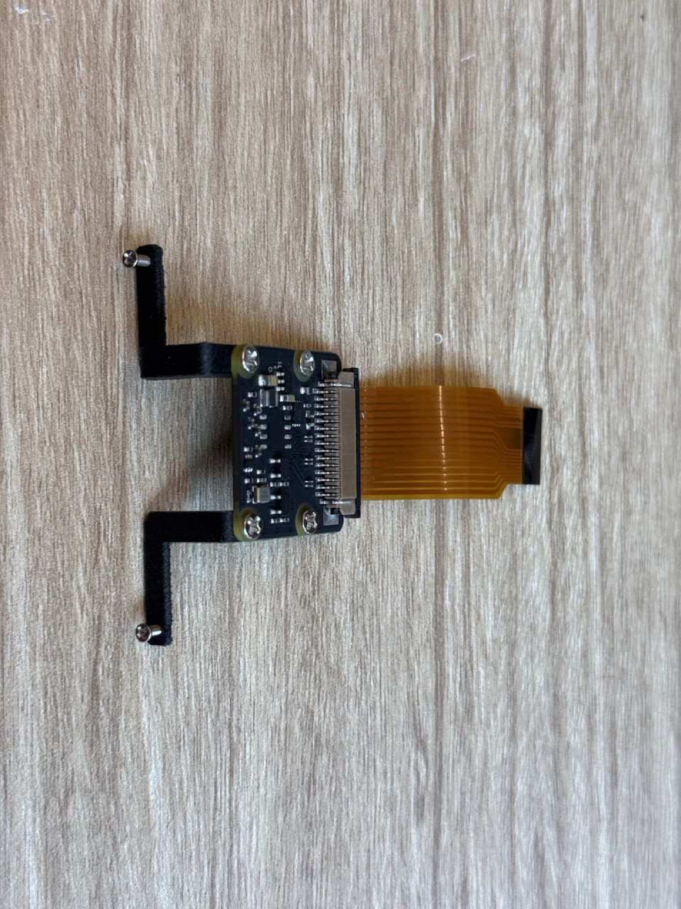

12. Install the camera holders on the Pi holders using 2 M1.4x4 screws.
13. Connect the camera board connector to the MIPI0 connector of the NANO board.
    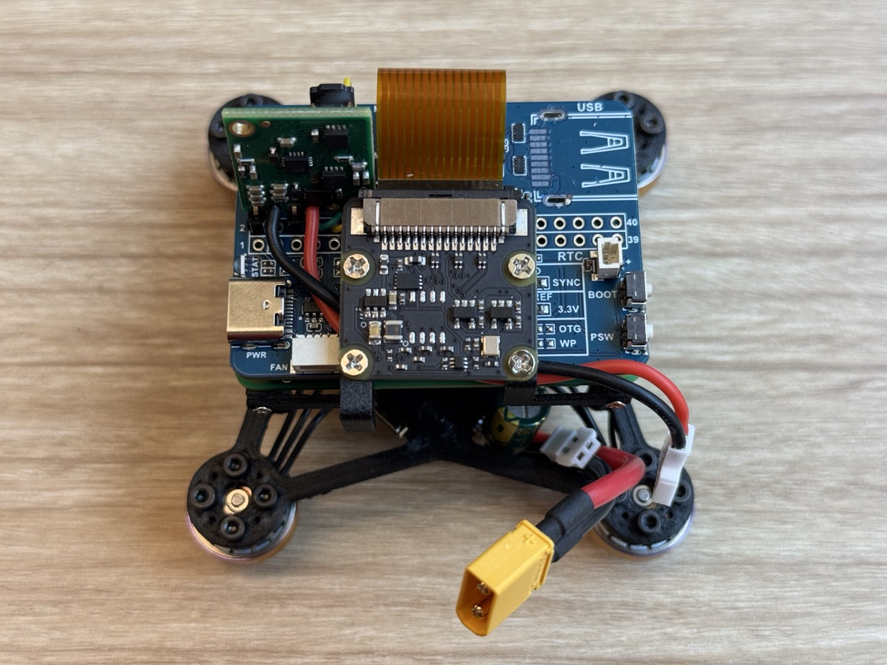

14. Do not install propellers until you have conducted the initial tests.
    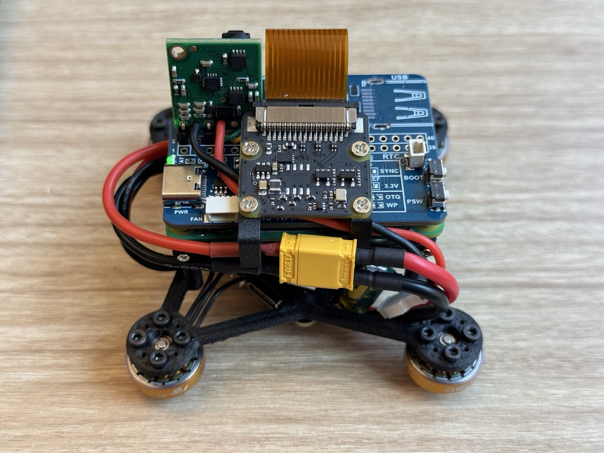

## Configure Raspberry Pi CM4/CM5

Using and configuring Raspberry Pi Compute Module requires a baseboard, here I used WaveShare Nano Base Board (A).
The instructions are the same for CM5 except noted otherwise.
Use the compatible baseboard based on the raspberry pi model as its camera interface is not cross-compatible between
CM4 and CM5.

### Install OS

Install Raspberry Pi OS 64-bit
following [this guide](https://www.raspberrypi.com/documentation/computers/compute-module.html#flash-compute-module-emmc).
Configure SSH and WiFi when writing the OS using Raspberry Pi Imager.
After installing the OS, ssh to the RPi and update the packages:

```
sudo apt update && sudo apt upgrade -y
```

### Camera Configuration

```
sudo vim /boot/firmware/config.txt
```

Add the following line under [cm4] or [cm5]:

for Raspberry Pi camera module 3:
```
dtoverlay=imx708,cam0
```

For ov9281 global shutter camera:
```
dtoverlay=ov9281,cam0
```

### Enable UART

1. Open config file:

```commandline
sudo vim /boot/firmware/config.txt
```

2. Paste this at the end

```
enable_uart=1
dtoverlay=disable-bt,uart0,ctsrts
```

3. Open cmdline file:

```commandline
sudo vim /boot/firmware/cmdline.txt
```

3. Remove this phrase `console=serial0,115200` if present.
2. Reboot Raspberry Pi:

```commandline
sudo reboot
```

### Create Python Environment

```
python3 -m venv env
```

To proceed with installing Python packages activate the env:

```
source env/bin/activate
```

Also, add the above to the `.bashrc` file to always activate venv.

### Install Mavlink-Router

Install [mavlink-router](https://github.com/mavlink-router/mavlink-router?tab=readme-ov-file).

```commandline
git clone https://github.com/mavlink-router/mavlink-router.git
cd mavlink-router
git submodule update --init --recursive
sudo apt install git meson ninja-build pkg-config gcc g++ systemd
meson setup build .
ninja -C build
sudo ninja -C build install
```

We will use this to connect to the drone using QGroundStation over WiFi and through Pi.

When the Pi and ground computer are connected to the same network run this on the Pi:

```commandline
mavlink-routerd -e 192.168.1.230:14550 /dev/ttyAMA0:921600
```

Then open QGroundControl and wait until it connects to the FC.

In the first stages of build process we need to connect to the drone wirelessly to configure and fly it using
joystick. Hence, it's convenient to start mavlink-routerd automatically on Pi start up.

1. Create a service file:

```commandline
sudo vim /etc/systemd/system/mavlink-router.service
```

2. Paste this:
   Replace `192.168.8.197` with the IP address of your ground computer.

```
[Unit]
Description=MAVLink Router
After=network.target

[Service]
ExecStart=/usr/bin/mavlink-routerd -e 192.168.8.197:14550 /dev/ttyAMA0:57600
Restart=on-failure
User=pi  # or whatever user you use

[Install]
WantedBy=multi-user.target
```

3. Reload systemd to pick up the new service:

```commandline
sudo systemctl daemon-reexec
sudo systemctl daemon-reload
```

4. Enable it to run at boot:

```commandline
sudo systemctl enable mavlink-router.service
```

5. Start it now (optional):

```commandline
sudo systemctl start mavlink-router.service
```

6. Confirm it works:

```commandline
sudo systemctl status mavlink-router.service
```

If you want to change the command later:

```commandline
sudo vim /etc/systemd/system/mavlink-router.service
sudo systemctl daemon-reload
sudo systemctl restart mavlink-router.service
```

If you no longer need it in the future:

```commandline
sudo systemctl disable mavlink-router.service
```

### Configure LED Strip

```
pip install rpi_ws281x adafruit-circuitpython-neopixel
pip install --force-reinstall adafruit-blinka
pip install adafruit-circuitpython-neopixel-spi lgpio
```

Enable SPI:
```
sudo vim /boot/firmware/config.txt
```
Paste this:
```
dtparam=spi=on
```

### Offboard Controller

Install mocap lib requirements:
```commandline
sudo apt install libboost-system-dev libboost-thread-dev libeigen3-dev ninja-build
```

Clone this repository on RPI and follow the help from the controller.py to fly the FLS.

```
cd ~
git clone https://github.com/flslab/fls-ap-offboard-controller.git
cd fls-ap-offboard-controller
mkdir logs
pip install -r requirements.txt
```

lib motioncapture is the one from https://github.com/IMRCLab/libmotioncapture.

### Marker Localization

Install dependencies:

```
sudo apt install -y cmake libopencv-dev nlohmann-json3-dev libeigen3-dev libcamera-dev
```

```
cd ~
git clone https://github.com/flslab/fls-marker-localization.git
```

Build:

```
cd fls-marker-localization
mkdir build
cd build
mkdir logs
cmake ..
make -j4
```

Copy Config:

```
cp ../src/gs_camera_config.json camera_config.json
```

Run for 10 seconds to test:

```
./eye -t 10
```

## Configure ArduPilot

### Install Ground Station Software

Install QGroundControl, QGC for short, from here.

[Mission Planner](https://ardupilot.org/planner/docs/mission-planner-installation.html) can also be used if on Windows.

### Install Firmware

We used ArduPilot 4.5.7 for this built. If your FC has another firmware installed by default, like BetaFlight of PX4,
first refer to Install Bootloader and download the bootloader on the FC. This information is usually marked on the
packaging box of the FC.

1. Download `4.5.7/MicoAir743v2_ArduCopter-4.5.7.apj`
   from [here](https://github.com/micoair/MicoAir743v2/tree/main/Firmware/Ardupilot).
2. Open QGC and go to Firmware tab by clicking on the Q icon and Vehicle Configuration in the top left
   corner.
3. When in the firmware tab, connect the FC to your computer using a USB type C cable.
4. Choose ArduPilot and select Custom firmware file... from the dropdown menu.
5. Hit Ok then browse and choose the `.apj` file you downloaded.
6. Wait until installation completes. Disconnect and connect and the board again.

You can load the parameters from `fls_v5.3.params` instead on setting them step by step using QGroundControl or Mission 
Planner. Review all the changes before writing the values to check if they match your setup.

### Choose Frame Type

In the Frame tab choose Quad and set the type to X.

### Sensor Calibration

Complete accelerometer calibration and level horizon from the Sensors tab.

### Battery Configuration

1. Go to the Power tab and set the capacity of battery to 650mAh.
2. Go to the Parameters tab and set `BATT_LOW_VOLT` to 6.6. This is the minimum voltage for 2S battery. Use 10.5 for
   3S or 14.0 for 4S.

### Logging
```
LOG_BITMASK 2506751 (Check all except for camera, raw imu, and video stabilization)
INS_LOG_BAT_MASK 1
INS_LOG_BAT_OPT 5
```

### Disable Arming Checks

Go to the Parameters and uncheck all items from `ARMING_CHECK`.

### Make Sure Serial Port is Set Correctly

We are using UART1 for FC - Pi communications. The default settings works without modifications. Make sure to change
the baud rate in the ArduPilot parameters and scripts/commands if you are not using the default.
```
SERIAL1_PROTOCOL 2 (MAVLink2)
SERIAL1_BAUD 921600
```

### Tune the PID

1. Go to the Tuning tab.
2. Enable the advanced mode.
3. Set the gains for the Rate controller according to this table for each axis:

| Axis  | P    | I     | D     |
|-------|------|-------|-------|
| Roll  | 0.04 | 0.05  | 0.003 |
| Pitch | 0.04 | 0.05  | 0.003 |
| Yaw   | 0.15 | 0.018 | 0     |

### Enable Harmonic Notch Filter

In ArduPilot, a harmonic notch filter is a type of signal processing filter used to attenuate specific frequencies,
typically those related to motor noise or vibrations. It's designed to remove these interfering frequencies from gyro
data, improving the accuracy and reliability of the flight control system.

1. Go to Parameters tab and set `INS_HNTCH_ENABLE` to 1.
2. Reboot using the option in the Tools menu.
3. Set the following parameters:

```
INS_HNTCH_ENABLE 1
INS_HNTCH_HMNCS 1 (set to 7 for three harmonics for tri-blade props)
INS_HNTCH_MODE 3 (ESC Telemetry)
INS_HNTCH_FREQ 400 (average hover RPM / 60)
INS_HNTCH_BW 100 (INS_HNTCH_FREQ / 4)
INS_HNTCH_REF 1
INS_HNTCH_OPTS 6 (Multi-source, Update at loop rate)
INS_ACCEL_FILTER 20
INS_GYRO_FILTER 100
```

### Bi-Directional DShot for RPM
```
RPM1_TYPE 5 (ESC Telemetry Motors Bitmask)
```
Reboot.
```
RPM1_ESC_MASK 15 (Channels 1 - 4)
SERVO_BLH_BDMASK 15 (Channels 1 - 4)
SERVO_BLH_POLES 12 (If using another motor count the number of magnets inside the rotor and put in the correct nomber)
SERVO_DSHOT_ESC 1 (BLHeli32/Kiss/AM32)
```

### Motors
Set `MOT_PWM_TYPE` to DShot300.

1. Disconnect FC from QGC.
2. Connect battery to the drone and wait until it stops buzzing.
3. Connect FC to QGC using USB.
4. In QGC, go to Motors tab.
5. Enable motor sliders.
6. Set the spin percentage to 5-10% by dragging the slider.
7. Spin the motors in turn by clicking on A, B, C, and D buttons.
8. Check the rotation direction of the motors.

If you need to change the direction of motors follow these steps:

1. Set SERVO_BLH_AUTO to 1 (enabled) and set SERVO_BLH_MASK to 15 (enable Channel1-4).
   **Note:** you should restore these two parameters to their default values after the ESC 
   configuration, otherwise the ESC cannot be worked normally.
2. Reboot the drone.
3. Go to [esc-configurator.com](https://esc-configurator.com) or [am32 configurator](https://am32.ca/configurator).
4. Click on Open Port Selection in the upper right corner, select "MicoAir743", and then click on Connect.
5. Click on Read Settings in the bottom right corner to read the configuration of the ESCs.
6. Change the motor rotation direction (Normal or Reverse) in the Motor Direction option for each ESC. The number 
   in front of ESC is the same as the numbers printed on the FC board.
7. Click Write Settings after configuration.
8. Disconnect.
9. Test the directions again to ensure they are correct.

## Initial Flight Test

After configuring ArduPilot, you are ready to conduct your first flight using a joystick.

1. Connect the joystick to your ground computer.
2. Open QGC.
2. Configure the joystick and assign buttons if needed in the Joystick tab of QGC.
TBD

## Install Compass

## Install MTF-02 (Flow and Range Finder Sensor)
1. Set the following parameters in QGC:
```
SERIAL4_BAUD 115
SERIAL4_OPTIONS 1024 (Don’t forward mavlink to/from)
SERIAL4_PROTOCOL 1 (MAVLink1)
FLOW_TYPE 5 (MAVLink)
RNGFND1_TYPE 10 (MAVLink)
```
2. Reboot FC to refresh the list of parameters.
3. Set the following parameters.
```
RNGFND1_MAX_CM 800
RNGFND1_MIN_CM 1
RNGFND1_ORIENT 25 (Down)
```

```
AHRS_EKF_TYPE 3
EK3_SRC_OPTIONS 0
EK3_SRC1_POSXY 0 (None)
EK3_SRC1_POSZ 2 (RangeFinder)
EK3_SRC1_VELXY 5 (OpticalFlow)
EK3_SRC1_VELZ 0 (None)
EK3_SRC1_YAW 1 (Compass)
EK3_GPS_CHECK 0
EK3_HGT_DELAY 0
```

```
AHRS_GPS_USE 0 (Disabled)
```

5. Connect the flow sensor using its connector the UART4 pin on the FC.


## Localization Settings
```
VISO_TYPE 1 (MAVLink)
VISO_POSE_M_NSE 0.1
```

### Flow sensor and range finder
```
EK3_SRC1_POSXY 0 (ExternalNav)
EK3_SRC1_POSZ 2 (RangeFinder)
EK3_SRC1_VELXY 5 (OpticalFlow)
```

### Camera and range finder
```
EK3_SRC1_POSXY 6 (ExternalNav)
EK3_SRC1_POSZ 2 (RangeFinder)
EK3_SRC1_VELXY 0 (None)
EK3_FLOW_USE None
```

### Vicon
```
EK3_SRC1_POSXY 6 (ExternalNav)
EK3_SRC1_POSZ 6 (ExternalNav)
EK3_SRC1_VELXY 0 (None)
EK3_FLOW_USE None
```

## Simulation

Download ArduPilot repository and set it up, then run the following command:

```
 ./Tools/autotest/sim_vehicle.py -v ArduCopter
```

run the offboard controller using the `--sim` argument to connect to the simulator.
